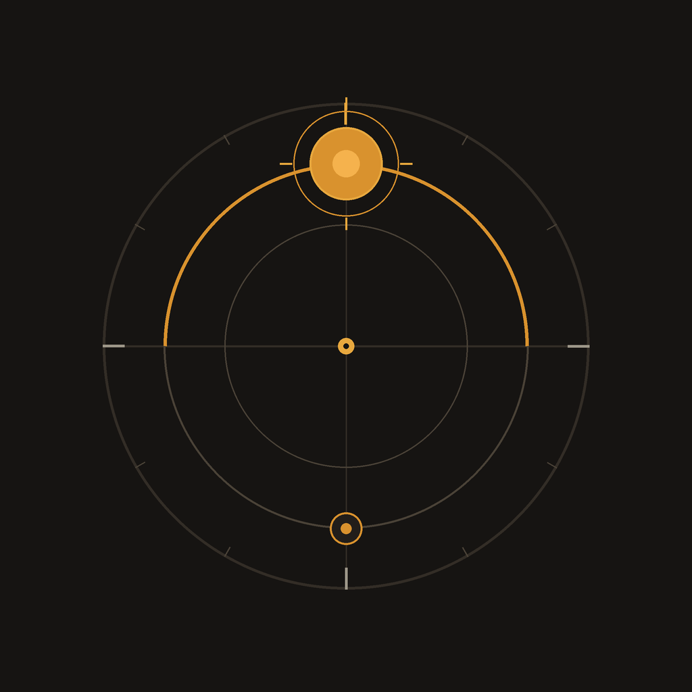

# KYNIO SOMNUS (Circadian Light & Sleep)

<div align="center">
  
  <br />
  <h3>Sincronização Circadiana, Luz Solar Matinal e Arquitetura do Sono</h3>
  <p><strong>Standalone Mobile App (Expo / React Native / TypeScript / SQLite Local-First)</strong></p>
  <p>
    
    
    
    
  </p>
</div>

---

## 1. Visão Geral & Proposta de Valor

**KYNIO Somnus** é uma aplicação móvel minimalista desenhada para sincronizar o relógio biológico mestre humano (núcleo supraquiasmático — SCN) através do binómio mais poderoso da biologia circadiana: **Luz Solar Matinal** e **Ciclos Ultradianos de Sono de 90 Minutos**.

Enquanto a maioria das aplicações do mercado tenta rastrear áudios noturnos ruidosos ou recolher dados sensíveis de saúde para servidores proprietários, o KYNIO Somnus foca-se na **causa primária** do ritmo biológico sob uma filosofia estrita de **Soberania de Dados (100% Local-First / RGPD)**.

---

## 2. Princípios & Motores Científicos

### ☀️ A. Âncora Fotónica Solar (NOAA 100% Offline)
* **Motor Astronómico Local:** Implementação estrita das equações da NOAA (*National Oceanic and Atmospheric Administration*) em TypeScript puro para determinar o ângulo de elevação solar exato, meio-dia solar e coordenadas do zénite sem qualquer chamada de API externa.
* **Cronómetro com Calibração Fotónica:** Temporizador de 10 a 60 minutos adaptado à luximetria do ambiente (Sol Direto a ~50.000 lux, Céu Nublado a ~12.000 lux ou Janela), essencial para cessar a produção de melatonina e iniciar a contagem regressiva para o sono noturno.

### 🌙 B. Planeador de Ciclos de Sono de 90 Minutos & DLMO
* **Evitação de Inércia do Sono:** Sincronização da hora de acordar com múltiplos de 90 minutos (4 ciclos / 6h, 5 ciclos / 7h30 recomendado, 6 ciclos / 9h recuperação).
* **Compensação de Latência:** Adiciona 14 minutos padrão de latência de sono antes de iniciar os ciclos.
* **Aviso de Crepúsculo (DLMO - Dim Light Melatonin Onset):** Cálculo do momento exato em que a melatonina endógena começa a ser secretada (~2 horas antes da hora de deitar recomendada) para reduzir iluminação de teto e ecrãs azuis.

### ☕ C. Medidor Farmacocinético de Depuração de Cafeína
* **Fórmula de Eliminação Exponencial:** $C(t) = C_0 \cdot 0.5^{t / t_{\text{half}}}$ com meia-vida padrão de 5 horas.
* **Indicador de Duas Zonas (*Safe* vs *Active*):** Garante que o utilizador atinge a hora de deitar com **menos de 25 mg** de cafeína ativa no cérebro, protegendo os recetores de adenosina essenciais para o sono profundo (estágios N3 e REM).

### 📈 D. Horizonte de Consistência & Social Jetlag
* **Check-in Matinal de 1 Toque:** Avaliação rápida do nível de inércia do sono ao acordar através de 5 ícones solares graduais (*Muito Lento* até *Energia de Pico*).
* **Social Jetlag:** Cálculo do delta médio entre dias de semana e fins de semana, gerando o Índice de Estabilidade Circadiana (0 a 100%).

---

## 3. Linguagem de Design: Circadiano

Inspirado em instrumentos astronómicos suíços e papéis de laboratório:
* **Fundo Diurno:** Papel natural não branqueado (`#EDE6D3`) e superfícies táteis (`#F4EFE2`).
* **Fundo Noturno (Crepúsculo):** Carvão profundo (`#161412`) para não agredir a visão noturna.
* **Acento Circadiano:** Âmbar solar radiante (`#D9922E` e `#E8A83E`).
* **Relógio Dot-Matrix:** Mostrador matricial de 5x7 em SVG para exibição da hora de acordar e sequência semanal.
* **Zero Sombras Artificiais:** Delimitação cirúrgica baseada em hairlines de 1px (`#DDD6C1` e `#332D26`).

---

## 4. Estrutura do Repositório

```
kyniosleep/
├── app/                        # Estrutura de ecrãs Expo Router
│   ├── (tabs)/
│   │   ├── index.tsx           # Aba Sol (Cúpula Solar, Banho de Luz, Cafeína)
│   │   ├── sleep.tsx           # Aba Sono (Ciclos de 90 min, Dot-Matrix, DLMO)
│   │   ├── consistency.tsx     # Aba Ritmo (Horizonte 7D, Check-in 1-Toque)
│   │   └── settings.tsx        # Aba Definições (Soberania RGPD, Coordenadas)
│   ├── onboarding/disclaimer.tsx # Gate Regulamentar Obrigatório (EU MDR / FDA)
│   └── paywall/index.tsx       # Subscrição KYNIO Pro (RevenueCat)
├── assets/                     # Ícones, Splash Screen e Favicons vetoriais
├── components/ui/              # Componentes de interface do Design System Circadiano
│   ├── solar-dome-clock.tsx    # Cúpula Celeste com Sol Radiante
│   ├── light-timer.tsx         # Barra de 4 pontos fotónicos
│   ├── caffeine-gauge.tsx      # Medidor de Duas Zonas de Cafeína
│   ├── cycle-selector.tsx      # Seletor de Ciclos Ultradianos
│   └── dot-matrix-clock.tsx    # Relógio Matricial 5x7
├── constants/colors.ts         # Tokens cromáticos Diurno/Noturno
├── db/                         # Persistência SQLite Local-First com Drizzle ORM
├── services/                   # Motores científicos e integrações nativas
│   ├── solarMathService.ts     # Equações NOAA offline
│   ├── sleepCycleService.ts    # Ciclos de 90 min e DLMO
│   ├── caffeineMetabolismService.ts # Farmacocinética de cafeína
│   ├── circadianIndexService.ts# Estabilidade e Social Jetlag
│   ├── notificationService.ts  # Agendamento de alertas push locais
│   └── inAppPurchaseService.ts # RevenueCat In-App Purchases
├── docs/app_store/             # Pacote de submissão para App Store & Google Play
├── eas.json                    # Configuração de compilação EAS Build
└── __tests__/                  # 32 Testes automatizados Jest
```

---

## 5. Como Executar Localmente

### Pré-requisitos
* Node.js >= 18
* Expo CLI (`npm install -g expo-cli eas-cli`)

### Instalação & Testes
```bash
# Instalar dependências
npm install

# Executar bateria completa de testes automatizados (32 testes em 11 suites)
npm test

# Iniciar servidor de desenvolvimento Expo
npm start

# Executar na Web ou abrir demonstração interativa
npm run web
```

---

## 6. Conformidade Legal & RGPD

* **Artigo 20.º do RGPD:** Exportação completa de histórico em formato aberto JSON através de `services/dbService.ts::exportFullUserHistoryJSON()`.
* **Artigo 17.º do RGPD:** Apagamento atómico e irreversível através de `services/dbService.ts::atomicDataWipe()`.
* **EU MDR / FDA General Wellness:** Consentimento informado e aviso de responsabilidade de saúde no primeiro lançamento da aplicação.

---

<div align="center">
  <p>Desenvolvido no ecossistema <strong>KYNIO Health Technologies</strong></p>
</div>
